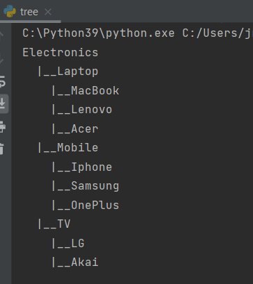

# Data structures and Algorithms

## Topics covered

- Linked List
- Hash Table
- Stack
- Queue
- Tree

- Graph
- Searching and Sorting

## Big-O cheatsheet

- [Big-0](https://www.bigocheatsheet.com/)

## Acknowledgements

- [codebasics](https://www.youtube.com/playlist?list=PLeo1K3hjS3uu_n_a__MI_KktGTLYopZ12)